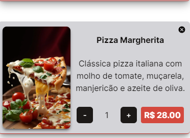
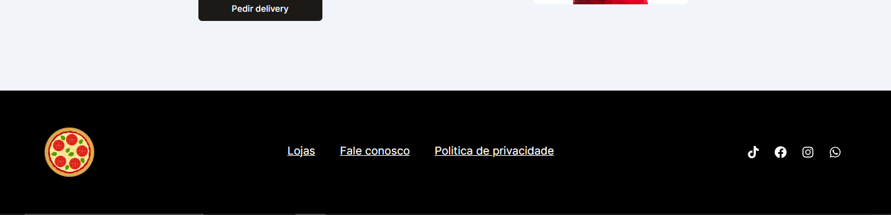

### Página Principal

Mobile / Desktop

Iniciamos com uma breve apresentação sobre a pizzaria do Zé, onde temos uma imagem buscada no Pinterest, um texto e um botão que leva para fazer o pedido abaixo das imagens.

  

Logo após, temos imagens de pizzas com nome, descrição e tópicos.

 

Agora temos a seção de parceiros onde temos lojas fictícias representando nossas lojas parceiras. A intenção é mostrar que poderia existir uma lista de lojas.

 

Tem um breve texto explicando para os clientes que temos delivery também e podem clicar no botão para fazer o pedido.

 

E o nosso rodapé com ícones de redes sociais e links. Obs: todos estão estáticos.

 

### Login e Cadastro

A página de login e cadastro tem os formulários apenas para exibição, entretanto o login necessita que preencham para uma experiência melhor.

#### Login

 

#### Cadastro

 

## Página Sobre

Aqui explicamos sobre a pizzaria, trazendo um texto.

 

## Página Loja

Entrando na página irá exibir um modal solicitando ao cliente que escolha entre informar o CEP para uma busca ou entre as pizzarias. A intenção é mostrar a possibilidade da criação de um sistema de busca por mapa onde o cliente pode encontrar a loja mais próxima do seu endereço ou fornecer um CEP para o endereço onde quer retirar.

 

#### Loja Escolhida

Aqui seria onde ele teria os dados da loja escolhida no modal anterior. Obs: os dados estão estáticos por enquanto.

 

A seguir, temos uma lista com promoções ou produtos em destaque, na versão mobile ele tem a possibilidade de scroll com rolagem.

 

#### Produtos

Aqui temos a lista para fazer o pedido onde clicando na pizza desejada é acrescentado ao carrinho.

 

#### Botões Inferiores

O primeiro botão da pizza serve para abrir o modal trazendo ao usuário o poder de escolher a loja, o segundo leva para o carrinho.

## Página de Carrinho

Aqui você vai poder encerrar o seu pedido.

Temos as informações do pedido, loja, cliente, itens, valor total.
Temos a possibilidade de escolher qual método deseja se é delivery ou retirada na loja e assim exibir um formulário para a opção escolhida.

 

## Melhorias a Serem Feitas

1.  tamanho da pizza.
2.  Trazer um sistema backoffice para gerenciar e administrar.
3.  Formas de pagamentos, cartão, pix, etc.
